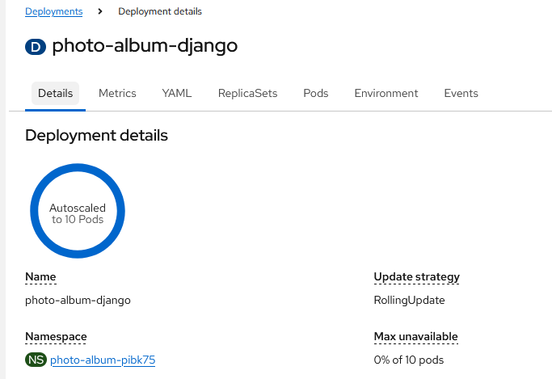
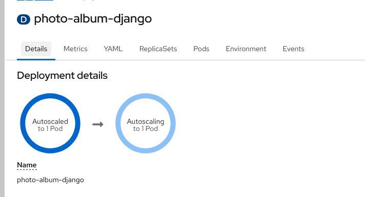
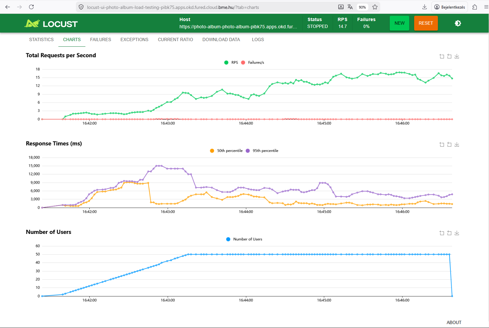

# Automatikus Skálázás és Terheléspróba a Photo Album weboldalhoz


## Automatikus Skálázás
A skálázáshoz az OoenShift környezetveb egy HorizontalPodAutoscaler (HPA) típusú objektumot haszáltam.

A HPA manifestjének specifikációja:

```yaml
kind: HorizontalPodAutoscaler
apiVersion: autoscaling/v2
metadata:
  name: photo-album-django-hpa
spec:
  scaleTargetRef:
    kind: Deployment
    name: photo-album-django
    apiVersion: apps/v1
  minReplicas: 1
  maxReplicas: 10
  metrics:
    - type: Resource
      resource:
        name: cpu
        target:
          type: Utilization
          averageUtilization: 50
```

A HPA működéséhez a Photo Album podokra erődorráskérés és limitet kellett beállítani:
Részlet a Photo-album deployment manifestjéből:
```yaml

resources:
  limits:
    cpu: 1600m
    memory: 2Gi
  requests:
    cpu: 400m
    memory: 512Mi
```

Valamint azért, hogy a skálázódáskor elinduló podok ne kaphassanak hálózati kérést, amíg teljesen fel-nem készült rá az alkalmazás, egy readyness probe-ot is raktam rá:

```yaml
readinessProbe:
  httpGet:
    path: /api/health/ready
    port: 8000
    scheme: HTTP
```
Igy csak a ready állapotú podok kaphatnak hálózati kérést.

Maximális skálázottség 10-szeres replikációval:

És "nyugalmi" állapot 1-szeres replikációval:


## Terhelésteszt

A terhelésteszt szimulálására Locust használtam. Az összes funkciót teztelő `locustfile.py` megtalálható a repositoryban.

A Locust-ot szintén OpenShift-ben telepítettem, egy Deploymentben.
A teszteléshez használt képfájlokat egy InitContainer tölti le és teszi egy megosztott tárhelybe.
A configurációs locustfilet egy ConfiMap-be raktam - innen olvassa be a pod. 
A photo albumot publikus url-en keresztül teszteli, nem pedig belső service dns-néven keresztül.

```yaml
kind: Deployment
apiVersion: apps/v1
metadata:
  name: locust
spec:
  replicas: 1
  selector:
    matchLabels:
      app: locust
  template:
    metadata:
      labels:
        app: locust
    spec:
      volumes:
        - name: locustfile
          configMap:
            name: locustfile
        - name: locust-images
          emptyDir: {}
      initContainers:
          name: init-images
          command:
            - /bin/sh
            - '-ec'
          imagePullPolicy: IfNotPresent
          volumeMounts:
            - name: locust-images
              mountPath: /images
          image: 'curlimages/curl:8.7.1'
          args:
            - |
              mkdir -p /images
              for code in 200 201 202 204 301 400 401 403 404 500; do
                curl -fsSL "https://http.cat/${code}.jpg" -o "/images/${code}.jpg"
              done
              ls -lah /images
      containers:
          name: container
          ports:
            - containerPort: 8080
              protocol: TCP
          imagePullPolicy: Always
          volumeMounts:
            - name: locustfile
              readOnly: true
              mountPath: /mnt/locust
            - name: locust-images
              readOnly: true
              mountPath: /mnt/locust/images
          terminationMessagePolicy: File
          image: locustio/locust
          args:
            - '-f'
            - /mnt/locust/locustfile.py
            - '--host=https://photo-album-photo-album-pibk75.apps.okd.fured.cloud.bme.hu'
```

A terhelési profilt a Locust UI-on állítottam be: 
 - Maximális terhelés: 50 User
 - Felfutási szaksz: 0.5 User/s
 - Időtartam: 5 min

A mellékelt ábra mutatja a terhelésteszt alatt készült reportokat:

